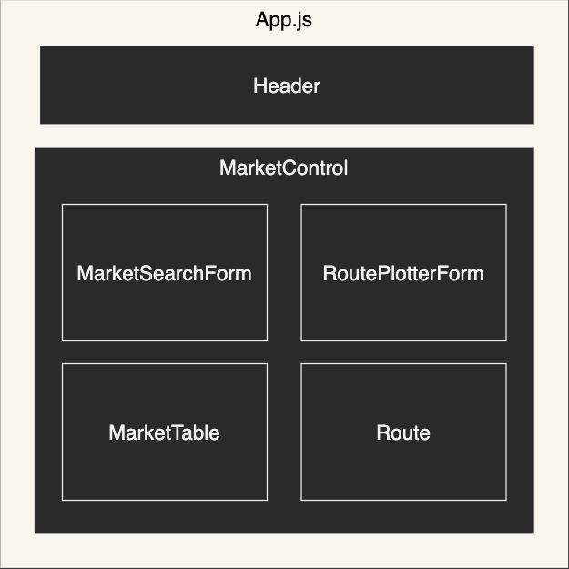

# Eve Online Interface

#### By Frank Proulx

#### A third party developer tool for Eve Online. Currently has an out-of-game market interface and route plotter, this project will be evolving over time.

## Technologies used:

* React
* Javascript
* JSX
* Node.js
* Postman
* Eve Swagger Interface API
* HTML
* CSS

## Description

The goal of this project is to build a comprehensive out-of-game 3rd party dev tool for the MMO Eve Online. I started playing Eve in 2007 and though I don't have much time for it these days I still enjoy popping back in from time to time. What I really like about the game is the sheer magnitude of complexity in its player run economy, arguably on par with some small countries. Due to the fact that everything in the game is player made, with hundreds of thousands of players logging in per day, 9 million active subscribers, and up to half a quadrillion items being sold per day, there is great need for tools that make life easier for Eve's miners, manufacturers, traders, as well as pirates, criminals and beyond.

This project uses the ESI (Eve Swagger Interface) API. It contains over a hundred endpoints, some public, some needing authentication with a character's account, with data pulled directly from the game's database. I started with a market interface for planning trading, buying or selling without having to be in game. I also was able to build a route planner for plotting out the sometimes treacherous routes amongst the thousands of star systems in game.

## Component Diagram
---      

## Setup/Installation Requirements  

* Create and/or navigate to the directory you would like to contain this project on your computer.
* Initialize a git repository by typing git init in the terminal.
* Type `git clone https://github.com/Frank-Proulx/capstone-eve-api-tool.git` to clone the repository to your local machine.
* cd into the new project directory.
* Type `npm install` in the terminal to install all dependencies.  
* Type `npm run start` into the terminal to start a server displaying the page on `http://localhost:3000/` in your browser.

# Link to Github pages:

[Eve Online Interface](https://frank-proulx.github.io/capstone-eve-api-tool/)

# Research & Planning log

Research and planning log located here [link to doc](https://github.com/Frank-Proulx/capstone-eve-api-tool/blob/main/research-log.md)

# Route documentation

See route documentation here [link to doc](https://github.com/Frank-Proulx/capstone-eve-api-tool/blob/main/route-documentation.md)

# App process documentation

There is a simplified breakdown of the process used to retrieve the displayed info here [link to doc](https://github.com/Frank-Proulx/capstone-eve-api-tool/blob/main/app-process.md)

# About page

[link to doc](https://github.com/Frank-Proulx/capstone-eve-api-tool/blob/main/about-page.md)

## Known Bugs

* Need to sometimes double click search in route planner, due to delay in setState computing.

## License

[MIT](https://opensource.org/licenses/MIT)

If you have any issues, questions, ideas or concerns, please reach out to me at my email and/or make a contribution to the code via GitHub.

Copyright (c) 2022 Frank Proulx
